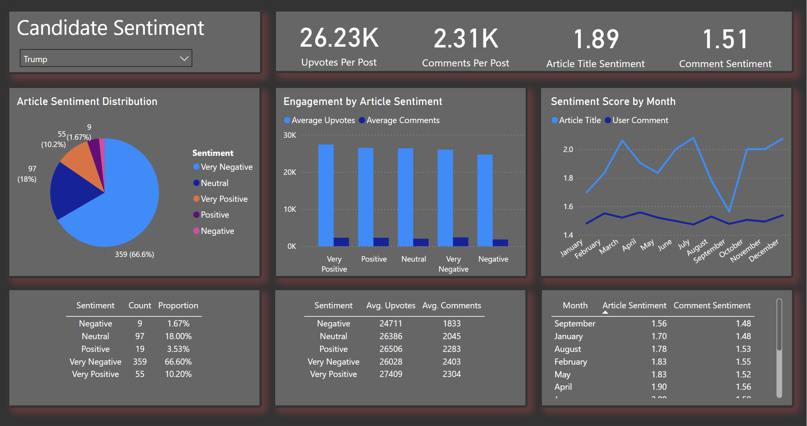

# election-sentiment
 Sentiment analysis surrounding the 2024 presidential election. Data sourced using Reddit API. Downloadable Power BI file is included in the repository. 

## North Star Metrics
- **Upvotes Per Post** - The number of upvotes per post is a key metric that can be used to gauge the popularity of a post. The higher the number of upvotes, the more popular the post is.
- **Comments Per Post** - The number of comments per post is another key metric that can be used to gauge the popularity of a post. The higher the number of comments, the more engaging the post is.
- **Article Title Sentiment** - The sentiment of the article title can be used to gauge the overall sentiment of the post. Scored from 1 to 5; 1 being very negative and 5 being very positive.
- **Comment Sentiment** - Scored from 1 to 5; 1 being very negative and 5 being very positive. Scored as the mean sentiment of all comments in the post.

## Summary of Insights
### 1. Popularity Trends
- **Average Upvotes** - Posts related to Kamala Harris garnered higher average upvotes (30,296) compared to Trump (26,228).
- **Maximum Upvotes** - The most upvoted post was about Trump, receiving 89,523 upvotes, indicating his ability to spark significant attention.
- **Average Comments** - Posts about Harris also had slightly higher average comments (2,460) than Trump (2,314), showing marginally higher engagement on average.
- **Maximum Comments** - Trump-related posts had the most commented thread with 42,408 comments, signifying his polarizing nature that drives conversations.
- **Article Title Sentiment** - Posts about Trump had a slightly higher average sentiment score (1.89) than those about Harris (1.41), though both skewed toward negative sentiment.
- **Positive Sentiment Peak** - Both candidates had posts or comments with the maximum sentiment score of 5, showing occasional highly positive reactions.
- **Negative Sentiment Dominance** - Both candidates' posts frequently leaned towards the most negative scores, highlighting the divisive topics discussed.
### 2. 
